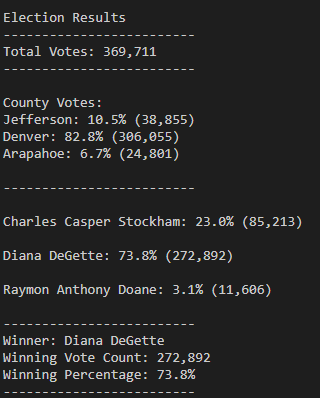

# Election-Analysis: using python scripts to automate the analysis of election tallies

## Project Overview
Tom and Seth of the Colorado Board of Elections are interested in automating the analysis of vote tallies.  I was asked to write a python script to analyze the results of the last election for one of the US congressional districts as a proof of concept.  The eventual goal is to apply this code to other congressional disticts as well as senetorial districts and local elections.  This script should output the following:
- The number of votes cast
- The number of and percentage of votes cast in each county
- The county that cast the most votes
- Number of votes recieved by each candidate and the percentage of the total vote earned
- The winner of the election based on popular vote
 
## Resources
* Data Source: [election_results.csv](Resources/election_results.csv)
* Software: Python 3.6.7, VSCode 1.43.2

## Results
- How many votes were cast in this congressional election?
   - Total Votes: 369,711
- Provide a breakdown of the number of votes and the percentage of total votes for each county in the precinct.
   - Jefferson: 38,855 votes (10.5%)
   - Denver: 306,055 votes (82.8%)
   - Arapahoe: 24,801 votes (6.7%)
- Which county had the largest number of votes?
    - Denver
- Provide a breakdown of the number of votes and the percentage of the total votes each candidate received.
   - Charles Casper Stockham: 85,213 votes (23.0%)
   - Diana DeGette: 272,892 votes (73.8%)
   - Raymon Anthony Doane: 11,606 votes (3.1%)
- Which candidate won the election, what was their vote count, and what was their percentage of the total votes?
   - Diana DeGette: 272,892 votes (73.8%)

**Figure 1:** Raw output for election audit.  See the [text file version](Analysis/election_results.txt).

## Summary
This script is already highly generalized, as it makes no assemptions about the number of counties or candidates.  These variables are determined on the fly.  This makes the script highly flexible for use with other elections.  It does, however, assume that voting is done by county and that the voters are voting on candidates in the print out and analysis file.  If the code used the header titles to label the outputs instead, then the code could also be applied to tallying votes by other groups of people (e.g. city or voting distrinct) and other topics (e.g. issues). The code also assumes that only two outputs are desired: stats on whatever is in the second and third columns of the dataset.  Instead, the code could be generalized to use a loop to analyze all columns in the data (exempting the first one, which is just the ballot ID).  This loop would require a single, standardized print/write schema and the use of column names to spcifiy what is being tallied as mentioned above.  It would require minimal time and effort to make these changes.

